# Azure Enterprise Landing Zone

## Business Problem

Enterprise cloud environments without governance controls become unmanageable fast. Teams deploy resources with no tagging standards, no network isolation, and no access controls. The result is unpredictable cloud spend, security gaps, and no visibility into who owns what.

This project builds the foundation that prevents that — a governed, secure, and repeatable Azure landing zone deployed entirely through Infrastructure as Code.

## What This Solves

- No tagging standards — policy enforcement blocks untagged resources automatically
- Flat networking with no isolation — hub and spoke architecture separates platform and workload traffic
- Uncontrolled access — RBAC ensures teams only access what they own
- Manual deployments — everything is code, repeatable and version controlled

## Architecture
## What This Builds

| Module | Resource | Purpose |
|---|---|---|
| management-groups | mg-landing-zone | Top level governance container |
| policy | Custom policy + assignment | Enforce environment tagging |
| networking | vnet-hub, vnet-spoke1, peering | Isolated hub and spoke network |
| rbac | Role assignments | Separate platform and workload access |

## Module Structure

## Prerequisites

- Azure CLI installed and authenticated
- Terraform >= 1.6.0
- Azure subscription with Owner or Contributor + Policy permissions

## How to Deploy
```bash
az login
terraform init
terraform plan
terraform apply
```

## Governance Controls

- Resources without an environment tag are denied at the management group level
- Platform team scoped to hub network only
- Workload team scoped to spoke network only
- All infrastructure version controlled and repeatable

## Screenshots

### Folder structure
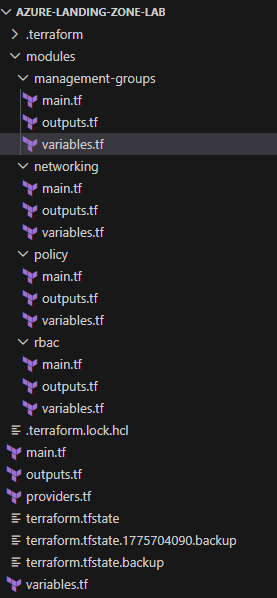
Modular Terraform project structure with separate modules for management groups, policy, networking, and RBAC. Each module is self-contained with its own inputs, outputs, and resources.

### Terraform init
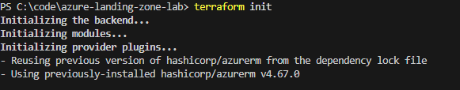
Azure provider successfully downloaded and initialized. Project is ready to authenticate and deploy resources to Azure.

### Management group
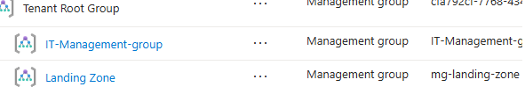
Management group mg-landing-zone created at the top of the Azure hierarchy. All governance policies and RBAC controls flow down from this level.

### Policy assignment
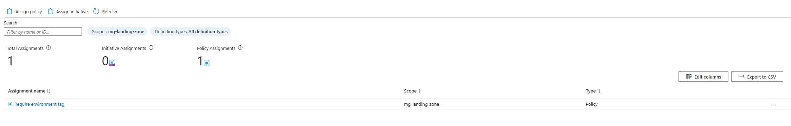
Custom Azure Policy enforcing environment tagging assigned at the management group scope. Any resource created without an environment tag is automatically denied — no workarounds possible at the subscription or resource group level.

### Resource groups
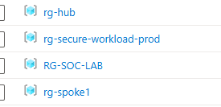
Separate resource groups for hub and spoke environments. Isolating them means each team only has visibility and access to their own resources.

### VNet subnets
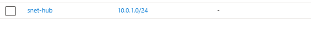
Hub virtual network with dedicated subnet. Resources deployed by the platform team live here — shared services, firewalls, and central connectivity.

### VNet peering

Bidirectional VNet peering between hub and spoke showing Connected status. Traffic between the two networks routes through the hub giving central visibility and control.

### IAM hub
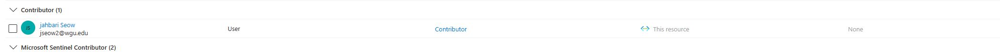
Contributor role assigned to the platform team on vnet-hub. Platform engineers can manage shared infrastructure without access to workload environments.

### IAM spoke
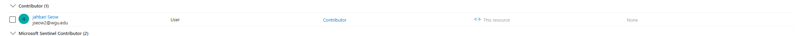
Contributor role assigned to the workload team on vnet-spoke1. App teams can deploy into their own spoke without touching the central hub network.

## Skills Demonstrated

- Infrastructure as Code with modular Terraform
- Azure governance, policy, and tagging standards
- Hub and spoke enterprise networking
- RBAC and identity separation
- Real world debugging and troubleshooting
---

# CI/CD Pipeline — Terraform Automation with GitHub Actions

## Business Problem

Manual Terraform deployments are error-prone and unauditable. Anyone can run
terraform apply from their laptop with no review, no approval, and no record
of what changed or who changed it. At enterprise scale that becomes a
compliance and stability risk.

This project automates the entire infrastructure deployment lifecycle through
a GitHub Actions pipeline — no manual commands, no portal clicking, full
audit trail on every change.

## What This Automates

- Every commit to main triggers terraform plan and terraform apply automatically
- Pull requests trigger terraform plan so reviewers can see what will change
  before it gets merged
- Azure authentication uses OIDC federated credentials — no stored secrets
- Terraform state is stored in Azure Storage with versioning and soft delete
  enabled so state can be recovered if corrupted

## Pipeline Structure
## Security Controls

- OIDC authentication — no long-lived credentials stored anywhere
- GitHub secrets for all sensitive values — never in code
- State stored in Azure Storage with versioning enabled
- Soft delete enabled on state backend — 7 day recovery window

## Screenshots

### Pipeline success
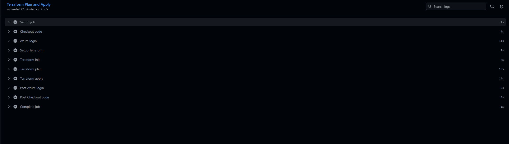
Full GitHub Actions workflow completing successfully. Every step green —
checkout, Azure login, Terraform init, plan, and apply.

### Terraform plan output
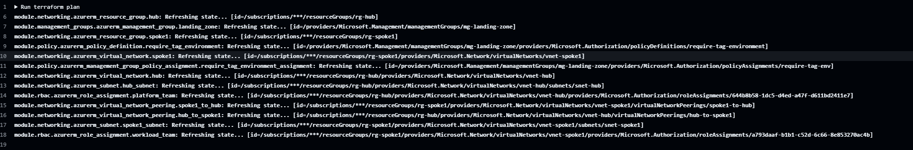
Pipeline showing the plan output before applying. In a pull request workflow
this is what a reviewer would approve before changes go live.

### Terraform apply output
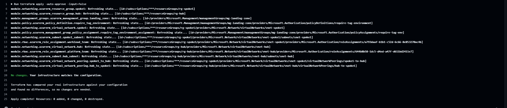
Apply completing inside the pipeline with no manual intervention. No terminal,
no typing yes — fully automated.

### GitHub secrets
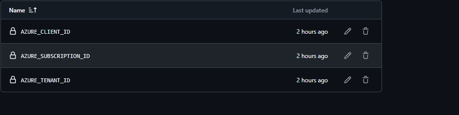
Three secrets configured for OIDC authentication — client ID, tenant ID, and
subscription ID. No passwords or keys stored anywhere.

### Workflow YAML
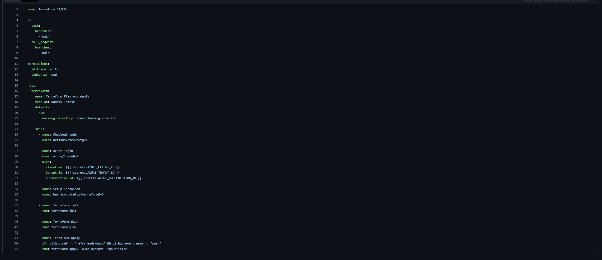
The pipeline configuration showing OIDC permissions, working directory, and
all Terraform steps.

### Terraform state backend
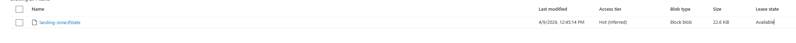
State file stored in Azure Storage. Both the pipeline and local Terraform
share the same state file — no conflicts, no duplicate deployments.

## Skills Demonstrated

- GitHub Actions CI/CD pipeline for infrastructure automation
- OIDC federated authentication to Azure — no stored secrets
- Remote Terraform state management with Azure Storage backend
- State versioning and recovery controls
- Automated plan and apply on every commit
---

## Change Management Workflow

### The problem with uncontrolled deployments

Without a change management process any engineer can deploy anything to
production at any time with no review and no record. At enterprise scale
that creates compliance failures, outages, and no audit trail.

### How this pipeline enforces change control

Every infrastructure change follows the same path with no exceptions.

**Pull request — plan only**

When a branch is pushed and a pull request is opened the pipeline
automatically runs terraform plan and posts the output as a comment on
the PR. Reviewers see exactly what will change before approving — which
resources get added, modified, or destroyed. Nothing is ambiguous.

**Merge to main — apply**

Only after a pull request is reviewed and approved does the merge to main
trigger terraform apply. The change deploys automatically with no manual
intervention.

**Automated PR creation**

Pull requests are created automatically by the pipeline when a branch is
pushed. Engineers cannot bypass the review process by pushing directly
to main — branch protection rules block direct commits.

**What this enforces**

- No infrastructure change reaches production without peer review
- Every deployment is tied to a pull request with full context
- GitHub provides the audit trail — who approved what and when
- The process is enforced at the pipeline level not by convention

### Branch strategy
### Skills demonstrated

- Git-based change management workflow using pull requests
- Automated PR creation using GitHub Actions
- Environment-based deployment controls separating plan and apply
- Branch protection and GitHub security settings
- Real-world debugging of GitHub Actions permissions and workflow failures
---

## Monitoring & Observability

## Business Problem

Deploying resources without monitoring is flying blind. When something breaks
you have no logs to query, no alerts to catch it early, and no audit trail
to understand what changed. At enterprise scale that means outages go
undetected and security incidents go unnoticed.

## What This Builds

| Resource | Purpose |
|---|---|
| Log Analytics workspace | Central database for all platform logs |
| Diagnostic settings on VNets | Network metrics and NSG events flow to workspace |
| Subscription activity logs | Full audit trail of every resource change and policy evaluation |
| Activity log alert | Fires every time a policy denial occurs |
| Action group | Emails platform team when alerts fire |
| DeployIfNotExists policy | Automatically configures monitoring on any new VM |

## Why DeployIfNotExists Matters

Most teams add monitoring manually per resource. The problem is someone
always forgets. The DeployIfNotExists policy enforces it at the platform
level — it does not matter how the VM was created or who created it.
The policy detects it and deploys diagnostic settings automatically.

## Cost Conscious Logging

Ingesting everything is a common mistake that gets expensive fast.
This setup ingests only what matters:

- Subscription activity logs — free and give a full audit trail
- NSG events and VNet metrics — low volume, high value for troubleshooting
- Policy and security categories — directly tied to governance controls
- Application and guest OS logs are skipped until workloads need them

Monthly cost for this setup is under $1.

## Screenshots

### Log Analytics workspace

Central workspace receiving logs from all platform resources. All KQL
queries run against this workspace.

### Alert rule
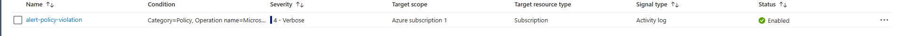
Activity log alert firing on every policy denial event. Governance
violations are tracked not just blocked.

### Action group
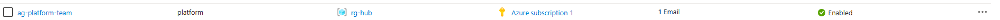
Email notification configured for the platform team. In enterprise
environments this would point to ServiceNow or PagerDuty.

### Diagnostic policy

DeployIfNotExists policy assigned at the management group scope.
Any new VM automatically gets diagnostic settings configured.

### VNet diagnostic setting
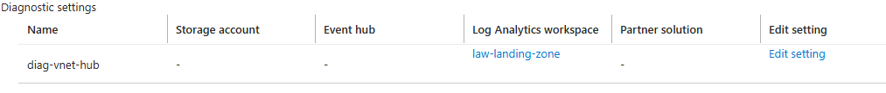
Hub VNet diagnostic setting pointing to the central Log Analytics
workspace. NSG events and metrics flow here automatically.

## Skills Demonstrated

- Azure Monitor and Log Analytics workspace design
- Cost conscious log ingestion strategy
- DeployIfNotExists policy for automated monitoring enforcement
- Activity log alerts tied to governance controls
- Observability as code through Terraform
